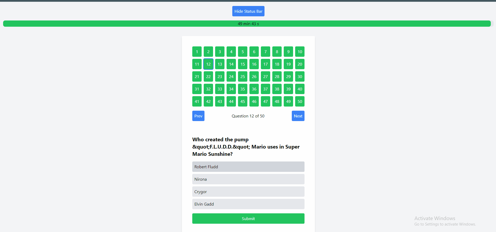

# Quiz App



This is a quiz application built with React and TypeScript. The application fetches quiz questions from an API, allows users to answer the questions, and provides a summary of correct and incorrect answers. The application also includes a timer that counts down and submits the quiz when the time is up.

## Features

- Fetches quiz questions from an API
- Displays questions in a randomized order
- Saves user answers and the current state in `localStorage`
- Allows users to resume from their previous state
- Displays a timer and submits the quiz when time is up
- Provides a summary of correct and incorrect answers

## Setup

### Prerequisites

- Node.js
- npm

### Installation

1. Clone the repository:

   ```bash
   git clone https://github.com/yourusername/quiz-app.git
   cd quiz-app
   ```

2. Install dependencies for both frontend and backend:

   ```bash
   npm install
   cd frontend
   npm install
   cd ../backend
   npm install
   ```

3. Start the backend server:

   ```bash
   cd backend
   npm start
   ```

4. Start the frontend development server:

   ```bash
   cd frontend
   npm start
   ```

5. The application should now be running on `http://localhost:3000`.

## Project Structure

```plaintext
quiz-app/
├── backend/
│   ├── src/
│   │   ├── data.json
│   │   └── server.ts
│   ├── package.json
│   └── tsconfig.json
├── frontend/
│   ├── src/
│   │   ├── api/
│   │   │   └── index.ts
│   │   ├── components/
│   │   │   ├── AlertBar.tsx
│   │   │   ├── App.tsx
│   │   │   ├── QuestionComponent.tsx
│   │   │   ├── StatusBar.tsx
│   │   │   └── Timer.tsx
│   │   ├── hooks/
│   │   │   └── useQuiz.ts
│   │   ├── types/
│   │   │   └── index.ts
│   │   ├── App.css
│   │   └── index.tsx
│   ├── package.json
│   └── tsconfig.json
├── package.json
└── README.md
```

## Components

### Timer

A countdown timer that displays the remaining time in the format `minutes min seconds s` and submits the quiz when time is up.

**Props:**

- `duration: number` - The total duration of the quiz in seconds.
- `onTimeUp: () => void` - Callback function to be called when the time is up.

### QuestionComponent

Handles the display of a single quiz question and allows users to navigate between questions.

**Props:**

- `question: Question` - The current question object.
- `currentQuestionIndex: number` - The index of the current question.
- `totalQuestions: number` - The total number of questions.
- `selectedAnswer: string | null` - The currently selected answer for the question.
- `selectedAnswers: (string | null)[]` - The array of selected answers.
- `showStatusBar: boolean` - Flag to show or hide the status bar.
- `onAnswer: (answer: string) => void` - Callback to handle when an answer is selected.
- `onNext: () => void` - Callback to navigate to the next question.
- `onPrev: () => void` - Callback to navigate to the previous question.
- `onQuestionSelect: (index: number) => void` - Callback to select a specific question.
- `onSubmit: () => Promise<void>` - Callback to handle answer submission.
- `onTimeUp: () => void` - Callback to handle when the time is up.
- `duration: number` - The total duration of the quiz in seconds.

### useQuiz Hook

Custom hook to manage the state and logic of the quiz.

**State:**

- `questions: Question[]` - Array of questions.
- `currentQuestionIndex: number` - Index of the current question.
- `correctAnswers: number` - Count of correct answers.
- `incorrectAnswers: number` - Count of incorrect answers.
- `selectedAnswers: (string | null)[]` - Array of selected answers.
- `showSummary: boolean` - Flag to show or hide the summary.
- `showConfirmation: boolean` - Flag to show or hide the confirmation dialog.

**Functions:**

- `handleAnswer: (answer: string) => Promise<void>` - Handles selecting an answer.
- `handleNext: () => void` - Navigates to the next question.
- `handlePrev: () => void` - Navigates to the previous question.
- `handleRestart: () => void` - Restarts the quiz.
- `loadStoredAnswers: () => void` - Loads stored answers from `localStorage`.
- `submitResult: () => Promise<void>` - Submits the quiz result.
- `handleTimeUp: () => void` - Handles when the time is up.

## API

### `fetchQuestions`

Fetches the quiz questions from the backend API.

### `submitSummary`

Submits the quiz summary to the backend API.

## Backend

The backend is a simple Express server that serves the quiz questions and handles the submission of quiz results.

### Endpoints

- `GET /api/questions` - Returns the quiz questions.
- `POST /api/submit-summary` - Accepts the quiz summary.
